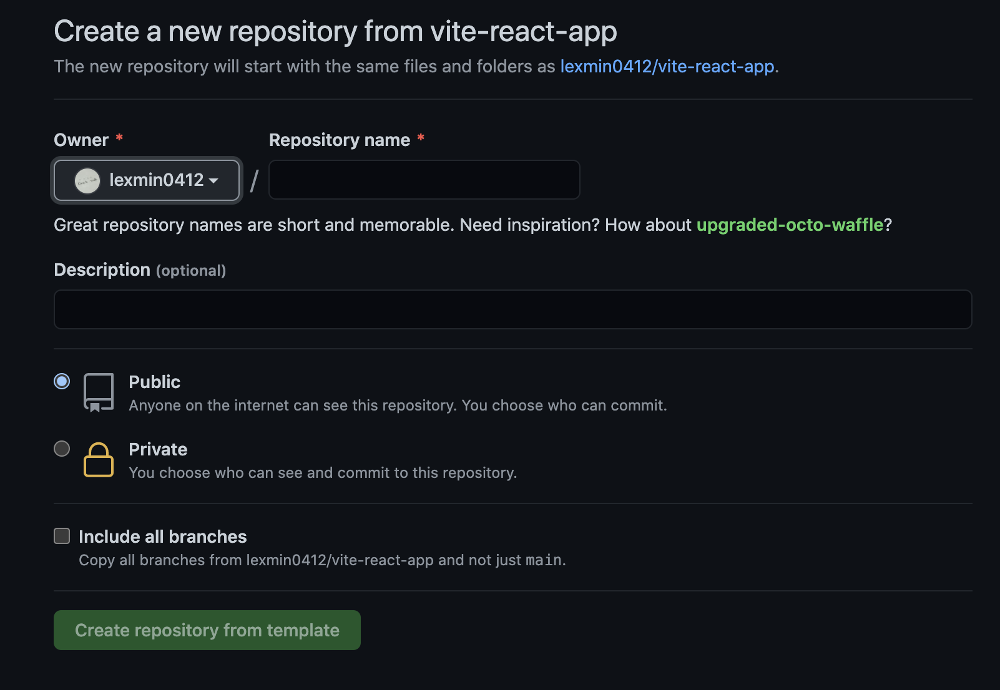

# Vite React App

这是一个 Vite 官方脚手架搭建的 React + TypeScript 模版。

## 使用

访问项目 [github地址](https://github.com/lexmin0412/vite-react-app)，点击`Use this template` 按钮。


然后会进入以下界面：



填入对应的信息后就会在个人 github 下创建一个对应的 repo。

## 开发

```bash
yarn dev    # 本地开发
yarn build  # 打包
yarn serve  # 本地启动服务器
```

## 个性化

### 修改项目名称

在根目录下的 `vite.config.ts` 文件中找到 base 选项，替换为你的项目名称即可。

### GitHub actions 自动构建

点击 github 右上角个人头像 -->  settings --> Personal Access Tokens，选择一个拥有 repo,workflow 权限的 token（之前个人保存的）复制，如果没有就新建一个并复制，然后进入当前项目 settings --> Secrets --> New repository secret，新建一个 secret 命名为 ACCESS_TOKEN（与 .github/workflows 下的密钥名称保持一致即可），重新触发构建即可。
